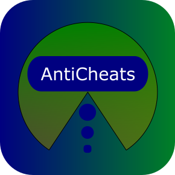
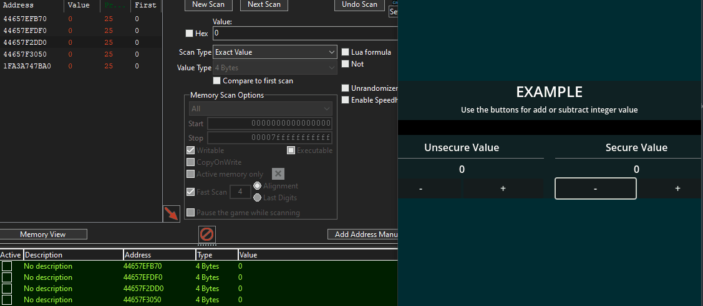

<p align="center">
  
</p>

# GDAnti-Cheats

This is my version of anti-cheats adapted for [Godot Engine] as plugin,
this plugin makes it difficult to use cheats locally.

[](https://godotengine.org/)  


## Table of contents

- [Description](#description)
- [Supported](#supported-)
- [Issues](#issues-)
- [Roadmap](#roadmap-)
- [License](#license-)

## Description
This plugin was created to prevent any possible manipulation of values ​​in programs or video games, such as increasing your character's stats in an unintended way.

### Example

_Use case image_ [↑](#Example)

## Supported [↑](#table-of-contents)
- **IntStream** _Integer values_
- **BoolStream** _Boolean Values_
- **FloatStream** _Float Values_
- **StringStream** _String Values_
- **VariantStream** _General purposes values_

## Others
- **TrackValue** _Can be used to monitor the list of changes similar to TrackerStream Scene._
- **TrackNet** _Helper class for check connection to complement the review of interceptions._

### Example
```gd
# my_logic_file.gd
## variable you want to protect
var secure_cash_wallet : IntStream = IntStream.new()

func add_cash(value : int) -> void:
	secure_cash_wallet.value += value

func get_total_cash() -> int:
	return secure_cash_wallet.value
```

## Issues [↑](#table-of-contents)
_Any bug or feature request you can make a Issue._

- Sometimes values ​​update too quickly as would happen with high scores, although I have optimized it to support updates of many variables, you may experience some issues with the flush technique at some point, for that you can **increase flush rate**.

## Flush rate updating [↑](#table-of-contents)
### Update flush single var
```gd
#demo_a.gd

##Flush single var
var my_secure_var : IntStream = IntStream.new()
func _ready() -> void:
	# If used in physics process, default 60 fps, in ≈5 seconds start flush the pointers data
	my_secure_var.flush_rate = 60 * 5 #(default 30)
```
### Update flush for all
```gd
#demo_b.gd

##Flush global update for all use singleton
func _ready() -> void:
	# If used in physics process, default 60 fps, in ≈5 seconds start flush the pointers data
	GDAntiCheats.FLUSH_RATE = 60 * 5 #(default 30)
```
## Also you can update the buffer if necessary [↑](#table-of-contents)
### Update buffer single var
```gd
#demo_c.gd

##Buffer single var
var my_secure_var : IntStream = IntStream.new()
func _ready() -> void:
	my_secure_var.buffer_size = 200 #(default 10)
```
### Update buffer for all
```gd
#demo_d.gd

##Buffer global update for all use singleton
func _ready() -> void:
	GDAntiCheats.BUFFER_SIZE = 200 #(default 10)
```

### TrackValue
This object is designed for monitoring, this technique involves progressively reviewing any abnormal values ​​you wish to verify, such as adding an amount of health that no element in the universe allows or a position change by a disproportionate distance.

There is also have function for create a copy at a new memory location.

> [!NOTE]
> The tracking method or value to be monitored varies depending on the needs of you project. (See the Trackvalue scene in example folder)

## Roadmap [↑](#table-of-contents)
- ~~TrackerStream~~

I am currently working on personal project and in the future I plan to create an anti-cheat API for online games, if you are interested you can follow me for future updates.

If you also expect me to create a native C++ module version of this project, please let me know.

## License [↑](#table-of-contents)

Copyrights (c) CodeNameTwister. See [LICENSE.md](LICENSE.md) for details.

[godot engine]: https://godotengine.org/
